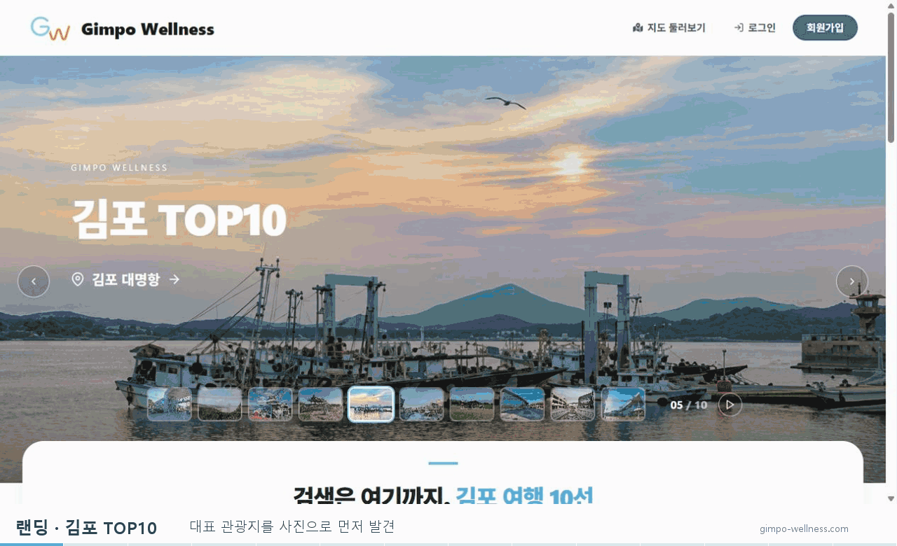
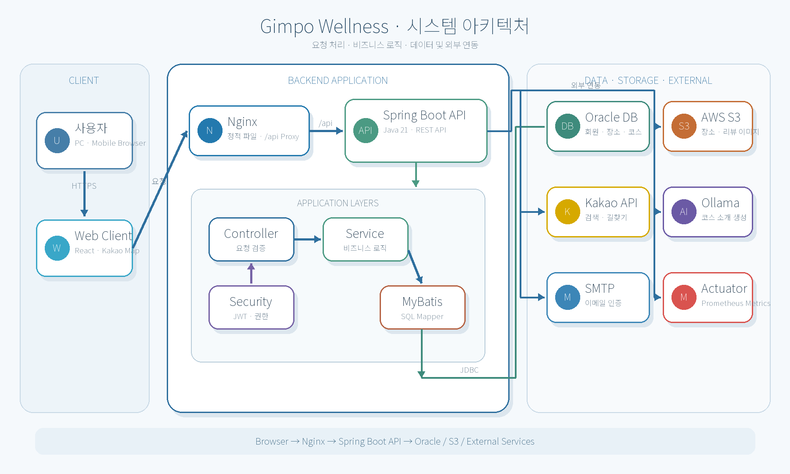
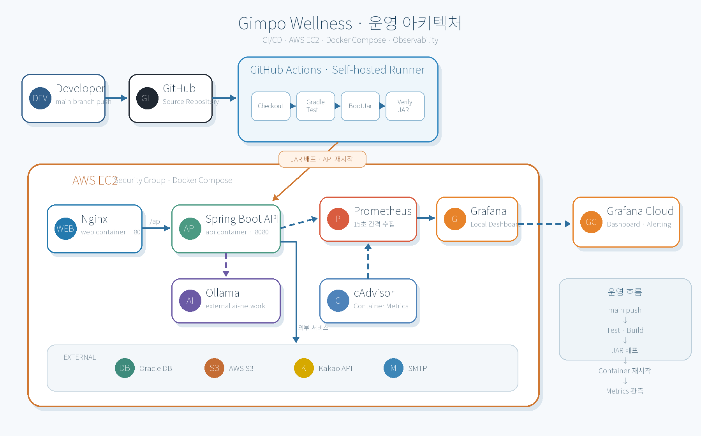
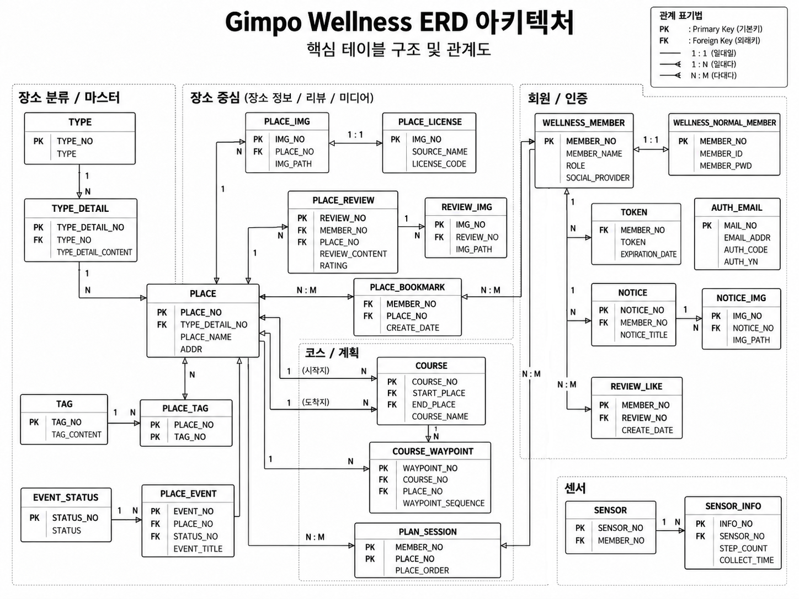

# Gimpo Wellness Backend

> 김포 관광 데이터를 연결하고, 사용자 조건에 맞는 여행 코스를 만드는 백엔드 API 서버

  
  

<!-- 완성된 GIF를 docs/images/gimpo-wellness-intro.gif 경로에 추가합니다. -->

  

---

## 프로젝트 개요

Gimpo Wellness는 김포의 관광지·음식점·체험 시설을 한곳에서 탐색하고, 여러 장소를 하나의 여행 코스로 연결할 수 있도록 만든 지도 기반 관광 서비스입니다.

기획 과정에서 **김포시청 관광진흥과 인터뷰**를 진행했습니다. 인터뷰를 통해 주요 관광지의 홍보 부족, 관광 정보의 분산, 세분화된 장소 검색의 어려움, 애기봉과 대명항 함상공원 주변 음식점 정보 부족을 확인했습니다.

백엔드는 이를 장소 통합 조회, 세부 분류와 태그, 김포 TOP 10, 주변 음식점, 길찾기, 여행 코스 추천 API로 구체화했습니다. 실시간 영업 여부와 단체 수용 인원처럼 검증 데이터가 부족한 항목은 향후 과제로 구분했습니다.

| 항목 | 내용 |
| --- | --- |
| 프로젝트명 | Gimpo Wellness |
| 팀명 | 웰니스와 깃커밋 |
| 개발 기간 | 2026.08.18 ~ 2026.09.11 |
| 개발 인원 | 4명 |

---

## 기술 스택

  
  
  
  
  
  
  
  
  
  
  
  
  
  

---

## 프로젝트 목표

- **해결하려던 문제**  
  김포의 관광 정보가 여러 채널에 흩어져 있고 장소 분류가 단순해, 사용자가 잘 알려지지 않은 관광지를 발견하거나 여러 장소의 이동 경로를 한 번에 계획하기 어려웠습니다.

- **바꾸려던 사용자 경험**  
  관광지를 개별적으로 검색하고 길찾기를 반복하는 과정에서 벗어나, 원하는 장소를 발견한 뒤 이동수단과 취향에 맞는 하나의 여행 코스까지 이어서 확인할 수 있도록 했습니다.

- **이번 프로젝트에서 해결할 범위**  
  관광 데이터 정제와 분류, 장소 조회, 이동수단별 길찾기, 여행·순례길 코스 생성, 인증·리뷰 API와 배포 전 자동 검증까지를 백엔드 범위로 구현했습니다. 실시간 영업 여부와 단체 수용 정보 갱신은 검증 가능한 데이터가 부족해 후속 과제로 남겼습니다.

---

## 주요 기능

### 장소 조회

관광지·음식점·체험 시설의 목록과 상세 정보, 좌표, 이미지를 조회합니다.  
대분류·세부 분류·태그 필터와 김포 TOP 10 전용 조회를 제공해 목적에 맞는 장소를 찾을 수 있습니다.

### 길찾기

자동차·대중교통·자전거·도보 경로를 외부 API에서 조회합니다.  
서비스가 이동수단과 관계없이 사용할 수 있도록 거리, 예상 시간, 안내 문구, 경로 좌표를 공통 응답 형식으로 변환합니다.

### 여행 코스 추천

시작 위치, 방문 장소 수, 선호 장소와 태그를 입력받아 3~10곳의 여행 코스를 생성합니다.  
Beam Search로 선호도와 이동 거리를 함께 비교해 조건에 맞는 방문 순서를 선택합니다.

### 순례길 코스

사찰 또는 김포성당을 목적지로 하는 순례길 코스를 조회합니다.  
정해진 방문 순서를 제공하고, 기준 경로 주변의 관광지를 최대 3개 경유지로 추가해 이동 거리가 짧은 방문 순서를 계산합니다.

### 코스 소개 생성

추천 로직이 방문 장소와 순서를 확정한 뒤 Ollama로 코스명과 소개 문구를 생성합니다.  
AI 응답은 정해진 스키마로 검증하며, 장소 선정과 경로 결정은 서버의 추천 로직이 담당합니다.

### 회원·이메일 인증

회원가입 전 이메일 중복 여부를 확인하고 5자리 인증 코드를 발송해 3분 이내 입력을 검증합니다.  
로그인 후 발급한 JWT와 Spring Security를 사용해 사용자와 관리자 권한을 구분합니다.

### 리뷰·이미지

장소 리뷰의 등록·조회·수정·삭제와 좋아요·북마크 상태를 관리합니다.  
이미지 원본은 S3에 저장하고 파일 경로와 형식 등 메타데이터는 DB에서 관리합니다.

### 공통 예외 처리

입력 오류, 권한 오류, 리소스 없음, 외부 API 실패를 예외 유형별로 구분합니다.  
전역 예외 처리기를 통해 상태 코드와 오류 메시지를 일관된 응답 구조로 반환합니다.

---

## 시스템 아키텍처

<!-- 이미지 준비 후 아래 파일을 추가합니다. -->

  

---

## 운영 아키텍처

<!-- 이미지 준비 후 아래 파일을 추가합니다. -->

  

---

## 데이터베이스 설계

<!-- ERD 이미지 준비 후 아래 파일을 추가합니다. -->

  

---

## 테스트 및 품질 검증

### CI/CD 자동 검증

`main` 브랜치에 코드가 반영되면 GitHub Actions의 self-hosted runner에서 `./gradlew test`를 먼저 실행합니다. 테스트가 통과해야 `./gradlew bootJar`로 실행 파일을 만들고, 산출물 확인 후 EC2 배포와 Docker 컨테이너 재시작을 진행합니다.

테스트나 빌드가 실패하면 뒤의 배포 단계가 실행되지 않으며, 전체 작업 결과는 Slack `#wellness-cicd` 채널로 공유됩니다.

### TDD 기반 개발과 이슈 관리

추천 점수와 주요 비즈니스 규칙을 테스트로 먼저 정의하고 `Red → Green → Refactor` 흐름으로 구현했습니다. 테스트와 QA에서 발견한 문제는 Notion 이슈관리대장에 우선순위·담당자·상태와 함께 기록했습니다.

| 전체 이슈 | 완료 | 진행 중 | 시작 전 |
| ---: | ---: | ---: | ---: |
| 19건 | 12건 | 2건 | 5건 |

카테고리 번호 정합성, 회원가입 500 오류, 관리자 코스 등록, 사용자 코스 생성 오류 등 12건을 완료했습니다. 중복 리뷰와 리뷰 이미지 MIME 검증은 진행 중이며, 대중교통 404 응답 등은 후속 이슈로 관리하고 있습니다.

### 30인 베타 테스트

총 **30명**을 대상으로 배포된 서비스를 사용한 뒤 리뷰를 수집했습니다. **새로운 지역과 코스를 발견하는 기능**, **지도·경로 정보**, **서비스의 가독성**이 장점으로 평가됐습니다.

정보와 리뷰가 부족해 방문 동기가 약한 점, 여행 서비스보다 길찾기 서비스에 가깝게 느껴지는 점, 지도 레이어와 추천 음식점 수로 인한 사용성 문제는 개선 대상으로 확인했습니다.

후속 개선 항목은 코스별 이동거리·소요시간 보강, 추천 음식점 필터와 개수 제한, 장소별 설명·리뷰·사진 확충입니다.

---

## 협업 및 개발 과정

요구사항, API 명세, ERD, 배포 기준, TDD 결과와 QA 이슈를 Notion의 `웰니스와 깃커밋` 워크스페이스에서 관리했습니다. GitHub Issue와 Pull Request로 코드 변경을 추적하고, 배포 결과와 커밋 정보는 Slack으로 공유했습니다.

| 기간 | 백엔드 주요 작업 |
| --- | --- |
| 08.18 ~ 08.21 | 인터뷰 준비, 요구사항 분석, 도메인·데이터 모델 설계 |
| 08.25 ~ 08.28 | API 명세, Oracle·MyBatis, JWT 인증, 배포 환경 구성 |
| 08.31 ~ 09.04 | 장소·회원·리뷰·고정 코스·경로 조회 API 구현 |
| 09.07 ~ 09.08 | 추천 코스, 순례길 코스, 태그·이미지·이메일 인증 연동 |
| 09.09 ~ 09.11 | 통합 오류 수정, TDD, 배포 후 검증과 이슈 관리 |

---

## 프로젝트 결과

| 영역 | 결과 |
| --- | --- |
| 장소 데이터 | 원본 1,264건을 검토해 411곳 선정 |
| 분류 데이터 | 태그 16종, 장소-태그 관계 1,166건 구성 |
| 경로 조회 | 자동차·대중교통·자전거·도보 응답 통합 |
| 여행 추천 | 선호 장소·태그·거리 조건 기반 3~10곳 코스 생성 |
| 순례길 코스 | 사찰·김포성당 목적지 조회, 경로 주변 경유지 추천과 방문 순서 계산 |
| 인증·파일 | JWT·이메일 인증, S3 이미지 관리 |
| 품질 관리 | CI 테스트 통과 후 자동 배포, 이슈관리대장 19건 관리 |

### 향후 과제

- 외부 경로 API와 Ollama 장애 시 대체 응답 보완
- 여행 계획을 DB에 저장해 여러 기기에서 조회하도록 확장
- 음식점 영업 정보와 단체 수용 정보를 갱신할 절차 마련
- 리뷰·좋아요 기반 추천의 조작 방지와 정렬 정책 구체화

---

## 담당 역할

| 팀원 | 백엔드 담당 영역 | GitHub |
| --- | --- | --- |
| **김선겸** | 이동수단별 경로 조회, 현재 위치 기반 계획, 선호 장소·태그 기반 여행 코스 추천 |  |
| **윤성현** | 이메일 중복 확인, 인증 코드 발송·만료 검증, 데이터·배포 환경 |  |
| **이다산** | 고정 코스, 순례길 후보 추천·경로 비교, 이미지 라이선스 관리 |  |
| **정주미** | 장소 목록·상세 조회 API, 분류·태그 기반 장소 조회 |  |

---

  <strong>관광 데이터를 연결해, 김포에서의 다음 목적지를 제안합니다.</strong>

